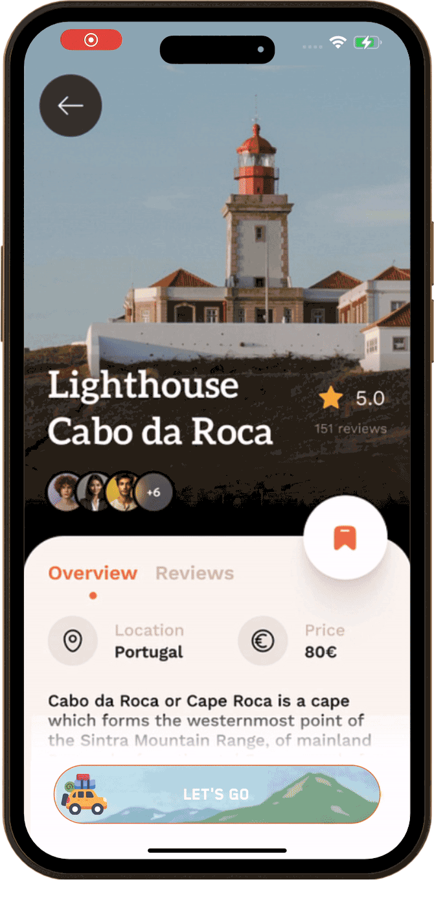
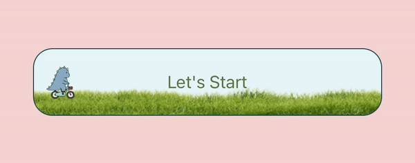

# React Native Custom Slider Button

<!-- [![Version][version-badge]][package] -->

[![MIT License][license-badge]][license]
[](https://www.npmjs.com/package/react-native-custom-slider-button)

Enhance your app's interactivity and uniqueness with this customizable package, allowing you to create animated buttons tailored perfectly to your app's theme.

<p>
    
    
    
    
</p>

## Motivation

🚀 Buttons are the gateway to interaction in any app. This customizable animated button package helps making every tap engaging and on-brand.

Our goal? **A delightful user experience, one button at a time**.

This package makes it easy to design buttons that look great and provide a better experience for your users.

## Key Features

**🎨 Theme Matching**

Bring your app's theme to life. Choose your background, icon, and title and more to create a unique design. The possibilities are endless!

**✨ Animated Interactions**

Add smooth animations to enhance user engagement.

**🛠️ Easy Integration**

Simple to implement in any React Native project with minimal setup.

**📱 Platform Support**

Ensure a consistent and smooth update experience across iOS & Android devices.

## Installation (RN > 0.60)

Install the package.

```sh
npm install react-native-custom-slider-button
```

Remember to install the pod with:

```sh
npx pod install
```

## Usage

Begin by importing the package into your screen to start using it.

```sh
import AnimatedButton from 'react-native-custom-slider-button';
```



**Start with the simplest setup**: Like the default design? Then all you need to do is add an onSwipeEnd function and you are good to go!

```sh
 <AnimatedButton
    onSwipeEnd={() => {
        onButtonSwiped();
    }}
/>
```

**Add Your Flavor**: Customize your overlay by tweaking the main title, description, colors, button title, and icon to perfectly match your app’s style.

```sh
 <AnimatedButton
    buttonWidth={200}
    buttonHeight={70}
    mainIcon={customIcon}
    backgroundImage={customBackgroundImage}
    mainIconHeight={50}
    mainIconWidth={50}
    buttonBorderColor={"#FFB996"}
    buttonBorderRadius={8}
    onSwipeEnd={() => {
        onButtonSwiped(true);
    }}
/>
```

**Customize the Title**: Set the text and style to match your preferences.

```sh
 <AnimatedButton
    primaryTitle={"My Primary Title"}
    secondaryTitle={"My Secondary Title"}
    titleSize={22}
    titleColor={"#CBE2B5"}
    titleFontFamily={"BlenderPro-Thin"}
    onSwipeEnd={() => {
        onButtonSwiped(true)
    }}
/>
```

**Want to Keep It Simple?** Disable the background image and text, leaving just the icon for a simple and minimalist design.

```sh
 <AnimatedButton
    primaryTitleRequired={false}
    secondaryTitleRequired={false}
    backgroundImageRequired={false}
    mainIcon={customIcon}
    buttonBackgroundColor={"#CBE2B5"}
    onSwipeEnd={() => {
        onButtonSwiped(true)
    }}
/>
```

## Properties

### Basic

| Prop                        | Description                                  | Type       |
| --------------------------- | -------------------------------------------- | ---------- |
| **`onSwipeEnd`**            | A function to run when the button is swiped. | _Function_ |
| **`buttonWidth`**           | Sets button width.                           | _Number_   |
| **`buttonHeight`**          | Sets button height.                          | _Number_   |
| **`buttonBorderColor`**     | Sets button border color.                    | _String_   |
| **`buttonBackgroundColor`** | Sets button background color.                | _String_   |
| **`buttonBorderRadius`**    | Sets button border radius.                   | _Number_   |

### Title

| Prop                         | Description                                                                               | Type      |
| ---------------------------- | ----------------------------------------------------------------------------------------- | --------- |
| **`primaryTitleRequired`**   | Allows to toggle the option to show or hide primary text as needed. (**default: true**)   | _Boolean_ |
| **`secondaryTitleRequired`** | Allows to toggle the option to show or hide secondary text as needed. (**default: true**) | _Boolean_ |
| **`primaryTitle`**           | Sets the primary title.                                                                   | _String_  |
| **`secondaryTitle`**         | Sets the secondary title.                                                                 | _String_  |
| **`titleSize`**              | Allows to customize the button title size.                                                | _Number_  |
| **`titleColor`**             | Allows to customize the button title color.                                               | _Boolean_ |
| **`titleFontFamily`**        | Allows to customize the button title font family.                                         | _String_  |

### Icon

| Prop                          | Description                                                                  | Type      |
| ----------------------------- | ---------------------------------------------------------------------------- | --------- |
| **`mainIcon`**                | Sets the custom icon.                                                        | _Image_   |
| **`mainIconWidth`**           | Sets width for the custom icon.                                              | _Number_  |
| **`mainIconHeight`**          | Sets height the custom icon.                                                 | _Number_  |
| **`backgroundImageRequired`** | Allows to toggle the option to display background image. (**default: true**) | _Boolean_ |
| **`backgroundImage`**         | Sets custom background image.                                                | _Image_   |

## License

This project is licensed under the MIT License - see the [LICENSE](LICENSE) file for details.

<!-- badges -->

[license-badge]: https://img.shields.io/badge/license-MIT-green.svg
[license]: https://opensource.org/licenses/MIT
